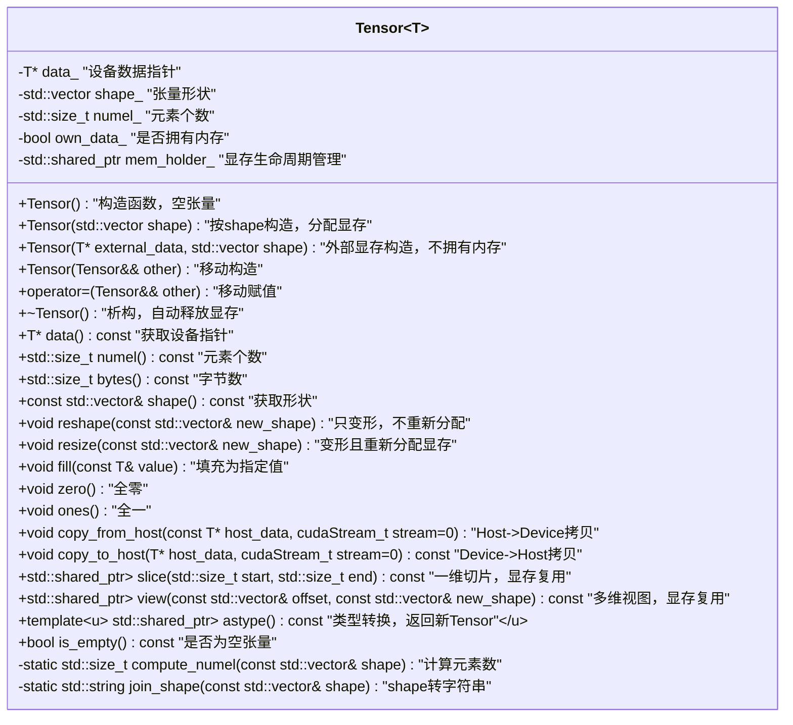

# Tensor 类设计与使用说明

## 1. 设计目标
- **高效显存管理**：基于 CudaMemoryPool 实现高效的 GPU 显存分配与复用。
- **灵活的数据结构**：支持多维 shape、动态变形、切片、视图、类型转换等。
- **易用性与安全性**：接口简洁，析构安全，支持显存所有权管理。
- **兼容深度学习/数值计算场景**。

---

## 2. 主要特性
- **高效分配/释放**：所有显存分配/释放均通过优化后的 CudaMemoryPool。
- **多维 shape 支持**：任意维度 shape，自动计算元素数。
- **移动语义**：支持高效移动构造/赋值，避免不必要的拷贝。
- **显存复用与自动释放**：切片/视图/类型转换等方法返回 `std::shared_ptr<Tensor<T>>`，多个 Tensor 可安全共享同一块显存，最后一个引用析构时自动释放。
- **显存所有权管理**：支持外部显存指针构造，支持只读视图/切片。
- **常用操作**：fill、zero、ones、resize、is_empty、copy_from_host、copy_to_host。
- **切片/视图**：支持一维切片、多维视图（不拷贝数据，返回子 Tensor）。
- **类型转换**：astype 支持任意类型转换，自动拷贝数据。

---

## 3. 接口说明

### 构造与析构
```cpp
Tensor<T> t({2, 3, 4}); // 创建 shape 为 2x3x4 的张量
Tensor<T> t2(ptr, shape); // 用外部显存指针构造（不拥有内存）
```

### 数据访问
```cpp
T* data() const; // 获取设备指针
std::size_t numel() const; // 元素个数
std::size_t bytes() const; // 字节数
const std::vector<std::size_t>& shape() const; // 形状
```

### 变形与重分配
```cpp
tensor.reshape(new_shape); // 只变形，不重新分配
// 变形且重新分配显存
tensor.resize(new_shape);
```

### 填充与拷贝
```cpp
tensor.fill(value); // 全部填充为 value
tensor.zero();      // 全部置零
tensor.ones();      // 全部置一
tensor.copy_from_host(host_ptr); // Host->Device
tensor.copy_to_host(host_ptr);   // Device->Host
```

### 切片与视图
```cpp
auto t2 = tensor.slice(start, end); // 一维切片，返回 std::shared_ptr<Tensor<T>>
auto t3 = tensor.view(offset, shape); // 多维视图，返回 std::shared_ptr<Tensor<T>>
```

### 类型转换
```cpp
auto t4 = tensor.astype<float>(); // 转为 float 类型，返回 std::shared_ptr<Tensor<float>>
```

### 只读/只视图
- 通过 slice/view/外部指针构造的 Tensor，不拥有内存，析构时不会释放显存。
- 多个 Tensor/视图/类型转换结果可安全共享同一块显存，最后一个引用析构时自动释放。

---

## 4. 使用建议
- 推荐所有 GPU 显存分配/释放均通过 Tensor 完成。
- 多线程/多算子并发场景下，配合 CudaMemoryPool 性能更优。
- 切片/视图适合做高效子张量操作，避免不必要的数据拷贝。
- 类型转换适合数据预处理、推理等场景。
- 推荐用 `std::shared_ptr<Tensor<T>>` 管理算子输出、切片、视图等，充分利用显存复用和自动释放。

---

## 5. 注意事项
- **析构安全**：只有拥有内存的 Tensor 析构时才释放显存，视图/切片析构不会重复释放。
- **显存复用**：多个 Tensor/视图/类型转换结果可安全共享同一块显存。
- **类型转换**：astype 会将数据拷贝到 host 再转换，适合小批量或推理场景。
- **多维视图**：view 需保证 offset+shape 不越界。
- **线程安全**：Tensor 本身线程安全，但同一对象不建议多线程并发写。

---

## 6. 联系与反馈
如有问题或建议，请联系项目维护者。 

---

## Tensor 类结构Mermaid图

