# CUDA Memory Pool 设计与使用说明

## 1. 设计目标

- **高性能**：支持高频率的显存分配与释放，适合深度学习等场景。
- **多线程友好**：通过线程局部缓存减少锁竞争，提升多线程环境下的效率。
- **内存复用**：分级管理和批量分配，减少显存碎片和 cudaMalloc/cudaFree 的开销。
- **智能管理**：自动碎片整理、多级缓存、性能统计等高级功能。
- **接口兼容**：对上层 tensor/算子等模块接口无侵入，便于集成和替换。

---

## 2. 主要特性

### 2.1 核心功能
- **分级内存池**：常用块大小分级（如 256B, 512B, 1KB, 2KB, 4KB, 8KB, 16KB, 32KB, 64KB, 128KB, 256KB, 512KB, 1MB），按需分配，减少碎片。
- **线程局部缓存**：每线程维护自己的空闲链表，极大减少全局锁竞争。
- **批量分配与回收**：分配/释放时批量操作，进一步降低 CUDA API 调用频率。
- **自动对齐**：所有分配自动按 256 字节对齐。

### 2.2 高级功能
- **多级缓存系统**：线程缓存 → 全局缓存 → 预分配池 → 设备分配
- **自动碎片整理**：监控碎片率，自动合并相邻块，清理过期块
- **性能统计**：实时监控内存使用情况、缓存命中率、分配频率等
- **预分配优化**：支持常用大小内存块的预分配
- **流感知分配**：支持CUDA流的异步内存管理
- **智能配置**：可配置的缓存大小、碎片阈值、检查间隔等参数

---

## 3. 接口说明

### 3.1 基础接口（向后兼容）

#### 单例获取
```cpp
CudaMemoryPool& pool = CudaMemoryPool::Instance();
```

#### 分配显存
```cpp
void* ptr = pool.Alloc(size_in_bytes);
```
- `size_in_bytes`：申请的字节数。
- 返回值：分配的显存指针。

#### 释放显存
```cpp
pool.Free(ptr, size_in_bytes);
```
- `ptr`：要释放的显存指针。
- `size_in_bytes`：分配时的字节数（建议与 Alloc 时一致）。

#### 释放所有空闲显存
```cpp
pool.ReleaseAll();
```
- 释放池中所有未被上层持有的显存。

### 3.2 增强接口

#### 流感知分配
```cpp
void* ptr = pool.Alloc(size_in_bytes, cudaStream_t stream);
pool.Free(ptr, size_in_bytes, cudaStream_t stream);
```

#### 配置管理
```cpp
// 获取当前配置
MemoryPoolConfig config = pool.GetConfig();

// 修改配置
config.thread_cache_max_blocks = 128;  // 线程缓存最大块数
config.global_cache_max_blocks = 2048; // 全局缓存最大块数
config.defrag_threshold = 0.2;         // 碎片整理阈值（20%）
config.defrag_interval_ms = 3000;      // 碎片检查间隔（3秒）
pool.SetConfig(config);
```

#### 性能统计
```cpp
// 获取统计信息
MemoryStats stats = pool.GetStats();

// 重置统计
pool.ResetStats();

// 打印详细统计
pool.PrintStats();
```

#### 内存管理
```cpp
// 手动触发碎片整理
pool.Defragment();

// 清理缓存
pool.TrimCache();

// 预分配内存块
pool.Preallocate(block_size, count);
```

---

## 4. 配置参数说明

### MemoryPoolConfig 结构
```cpp
struct MemoryPoolConfig {
    std::size_t alignment = 256;                    // 内存对齐字节数
    std::size_t thread_cache_max_blocks = 64;       // 线程缓存最大块数
    std::size_t global_cache_max_blocks = 1024;     // 全局缓存最大块数
    std::size_t batch_alloc_count = 16;             // 批量分配数量
    std::size_t defrag_threshold = 0.3;             // 碎片整理阈值（30%）
    std::size_t defrag_interval_ms = 5000;          // 碎片检查间隔（5秒）
    bool enable_stats = true;                       // 是否启用统计
    bool enable_defrag = true;                      // 是否启用自动碎片整理
};
```

### MemoryStats 结构
```cpp
struct MemoryStats {
    std::atomic<std::size_t> total_allocated{0};    // 总分配字节数
    std::atomic<std::size_t> total_freed{0};        // 总释放字节数
    std::atomic<std::size_t> peak_usage{0};         // 峰值使用量
    std::atomic<std::size_t> current_usage{0};      // 当前使用量
    std::atomic<std::size_t> fragmentation_bytes{0}; // 碎片字节数
    std::atomic<std::size_t> allocation_count{0};   // 分配次数
    std::atomic<std::size_t> free_count{0};         // 释放次数
    std::atomic<std::size_t> cache_hits{0};         // 缓存命中次数
    std::atomic<std::size_t> cache_misses{0};       // 缓存未命中次数
};
```

---

## 5. 使用建议

### 5.1 基础使用
- 推荐所有 CUDA 显存分配/释放均通过本内存池接口完成。
- 多线程/多算子并发场景下，性能提升尤为明显。
- 若需与 STL allocator 适配，可基于本池实现自定义 allocator。

### 5.2 高级优化
- **预分配**：在应用启动时预分配常用大小的内存块
- **配置调优**：根据应用特点调整缓存大小和碎片阈值
- **监控统计**：定期检查内存使用情况和缓存命中率
- **流管理**：在CUDA流环境中使用流感知的分配接口

### 5.3 性能调优示例
```cpp
auto& pool = CudaMemoryPool::Instance();

// 1. 预分配常用大小
pool.Preallocate(4096, 20);   // 4KB块，预分配20个
pool.Preallocate(16384, 10);  // 16KB块，预分配10个

// 2. 配置优化参数
MemoryPoolConfig config = pool.GetConfig();
config.thread_cache_max_blocks = 128;  // 增加线程缓存
config.defrag_threshold = 0.2;         // 降低碎片阈值
pool.SetConfig(config);

// 3. 定期监控
pool.PrintStats();
```

---

## 6. 注意事项

- **接口兼容**：本重构未改变 Alloc/Free/ReleaseAll 的接口签名，上层 tensor/算子代码无需修改。
- **线程安全**：池本身线程安全，但返回的显存指针仅建议在分配线程内使用。
- **分级对齐**：实际分配的显存大小可能大于请求值（向上取整到分级），但不影响上层使用。
- **超大块处理**：超出最大分级的显存直接 cudaMalloc/cudaFree，不进池。
- **ReleaseAll** 仅释放池中空闲块，不影响已分配给上层的显存。
- **碎片整理**：自动碎片整理在后台进行，不会阻塞正常分配操作。
- **统计开销**：统计功能会带来少量性能开销，可通过配置关闭。

---

## 7. 性能特性

### 7.1 多级缓存架构
```
分配优先级：线程缓存 → 全局缓存 → 预分配池 → 设备分配
释放策略：线程缓存 → 全局缓存（超阈值时）
```

### 7.2 缓存命中率优化
- 线程局部缓存减少锁竞争
- 批量分配减少CUDA API调用
- 预分配池提供快速分配路径

### 7.3 内存碎片管理
- 自动检测碎片率
- 合并相邻空闲块
- 清理长时间未使用的块
- 可配置的碎片整理策略

---

## 8. 联系与反馈
如有问题或建议，请联系项目维护者。

---

## CUDA Memory Pool 内存维护流程Mermaid图

```mermaid
flowchart TD
    subgraph "分配流程"
        A["上层调用 Alloc(size)"] --> B{"size 是否超最大分级？"}
        B -- "是(超大块)" --> C["直接 cudaMalloc 分配，返回指针"]
        B -- "否(常规块)" --> D{"线程局部缓存有空闲块？"}
        D -- "有" --> E["从线程局部缓存分配"]
        D -- "无" --> F{"全局缓存有空闲块？"}
        F -- "有" --> G["从全局缓存分配"]
        F -- "无" --> H{"预分配池有空闲块？"}
        H -- "有" --> I["从预分配池分配"]
        H -- "无" --> J["cudaMalloc 批量分配新块"]
        E & G & I & J --> K["记录分配信息，更新统计"]
        K --> L["检查碎片率，触发整理"]
        L --> M["返回显存指针"]
    end

    subgraph "释放流程"
        N["上层调用 Free(ptr, size)"] --> O{"size 是否超最大分级？"}
        O -- "是(超大块)" --> P["直接 cudaFree 释放"]
        O -- "否(常规块)" --> Q["从已分配列表移除"]
        Q --> R["归还到线程局部缓存"]
        R --> S{"线程缓存超阈值？"}
        S -- "是" --> T["批量回收部分块到全局缓存"]
        S -- "否" --> U["保留在本线程缓存"]
        T & U --> V["更新统计信息"]
    end

    subgraph "碎片整理"
        W["定期检查碎片率"] --> X{"碎片率 > 阈值？"}
        X -- "是" --> Y["合并相邻块"]
        Y --> Z["压缩碎片块"]
        Z --> AA["清理过期块"]
        X -- "否" --> BB["继续监控"]
    end

    subgraph "全局释放"
        CC["调用 ReleaseAll"] --> DD["释放全局缓存所有空闲块"]
        DD --> EE["释放预分配池所有块"]
        EE --> FF["释放流缓存所有块"]
        FF --> GG["重置统计信息"]
    end

    style A fill:#e6f7ff
    style N fill:#e6f7ff
    style W fill:#e6f7ff
    style CC fill:#e6f7ff
```



---

**说明：**
- **分配流程**：四级缓存系统，优先使用缓存，最后才调用cudaMalloc
- **释放流程**：智能缓存管理，自动平衡线程缓存和全局缓存
- **碎片整理**：后台自动进行，不影响正常分配操作
- **全局释放**：完全清理所有缓存和预分配的内存块 