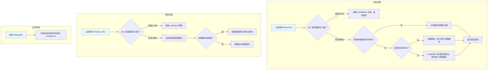

# CUDA Memory Pool 设计与使用说明

## 1. 设计目标

- **高性能**：支持高频率的显存分配与释放，适合深度学习等场景。
- **多线程友好**：通过线程局部缓存减少锁竞争，提升多线程环境下的效率。
- **内存复用**：分级管理和批量分配，减少显存碎片和 cudaMalloc/cudaFree 的开销。
- **接口兼容**：对上层 tensor/算子等模块接口无侵入，便于集成和替换。

---

## 2. 主要特性

- **分级内存池**：常用块大小分级（如 256B, 512B, 1KB, ...），按需分配，减少碎片。
- **线程局部缓存**：每线程维护自己的空闲链表，极大减少全局锁竞争。
- **批量分配与回收**：分配/释放时批量操作，进一步降低 CUDA API 调用频率。
- **自动对齐**：所有分配自动按 256 字节对齐。
- **接口分离**：全局池与线程缓存分工明确，便于维护和扩展。

---

## 3. 接口说明

### 单例获取
```cpp
CudaMemoryPool& pool = CudaMemoryPool::Instance();
```

### 分配显存
```cpp
void* ptr = pool.Alloc(size_in_bytes);
```
- `size_in_bytes`：申请的字节数。
- 返回值：分配的显存指针。

### 释放显存
```cpp
pool.Free(ptr, size_in_bytes);
```
- `ptr`：要释放的显存指针。
- `size_in_bytes`：分配时的字节数（建议与 Alloc 时一致）。

### 释放所有空闲显存
```cpp
pool.ReleaseAll();
```
- 释放池中所有未被上层持有的显存。

---

## 4. 使用建议

- 推荐所有 CUDA 显存分配/释放均通过本内存池接口完成。
- 多线程/多算子并发场景下，性能提升尤为明显。
- 若需与 STL allocator 适配，可基于本池实现自定义 allocator。

---

## 5. 注意事项

- **接口兼容**：本重构未改变 Alloc/Free/ReleaseAll 的接口签名，上层 tensor/算子代码无需修改。
- **线程安全**：池本身线程安全，但返回的显存指针仅建议在分配线程内使用。
- **分级对齐**：实际分配的显存大小可能大于请求值（向上取整到分级），但不影响上层使用。
- **超大块处理**：超出最大分级的显存直接 cudaMalloc/cudaFree，不进池。
- **ReleaseAll** 仅释放池中空闲块，不影响已分配给上层的显存。

---

## 6. 联系与反馈
如有问题或建议，请联系项目维护者。 

---

## CUDA Memory Pool 内存维护流程Mermaid图



---

**说明：**
- 分配流程：优先用线程局部缓存，其次全局池，最后 cudaMalloc。超大块直接 cudaMalloc。
- 释放流程：常规块归还线程缓存，超大块直接 cudaFree。线程缓存超阈值时批量回收至全局池。
- 全局释放：ReleaseAll 只释放全局池空闲块，不影响线程缓存和已分配块。 