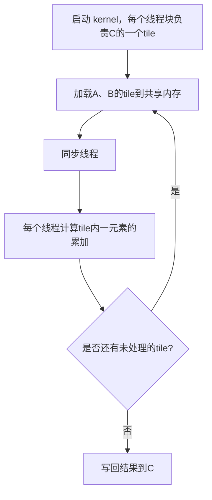

# GEMM 算法与 CUDA Kernel 实现简介

## 什么是 GEMM

GEMM（General Matrix Multiply）是通用矩阵乘法的缩写，指的是如下形式的矩阵运算：
C = α * A * B + β * C


其中，A、B、C 分别为矩阵，α、β 为标量。GEMM 是深度学习、科学计算等领域的核心算子。

---

## CUDA Kernel 实现原理

本项目中的 GEMM kernel 采用了**共享内存分块（Tiling）优化**，大幅提升了内存访问效率。其主要流程如下：

1. **线程块分配**  
   每个线程块负责计算输出矩阵 C 的一个 TILE × TILE 的子块。

2. **加载子块到共享内存**  
   每次迭代从全局内存加载 A、B 的一个 TILE 子块到共享内存，减少全局内存访问。

3. **子块乘加**  
   线程块内所有线程协作完成当前子块的乘加累加。

4. **写回结果**  
   计算完成后，将结果写回输出矩阵 C 的对应位置。

---

## 关键 Kernel 代码片段

```cuda
template <typename T, int TILE>
__global__ void gemm_kernel_tiled(int m, int n, int k, T alpha, const T* A, const T* B, T beta, T* C) {
    __shared__ T As[TILE][TILE];
    __shared__ T Bs[TILE][TILE];

    int row = blockIdx.y * TILE + threadIdx.y;
    int col = blockIdx.x * TILE + threadIdx.x;
    T sum = 0;

    for (int t = 0; t < (k + TILE - 1) / TILE; ++t) {
        int tiled_col = t * TILE + threadIdx.x;
        int tiled_row = t * TILE + threadIdx.y;
        As[threadIdx.y][threadIdx.x] = (row < m && tiled_col < k) ? A[row * k + tiled_col] : 0;
        Bs[threadIdx.y][threadIdx.x] = (col < n && tiled_row < k) ? B[tiled_row * n + col] : 0;
        __syncthreads();

        for (int i = 0; i < TILE; ++i)
            sum += As[threadIdx.y][i] * Bs[i][threadIdx.x];
        __syncthreads();
    }

    if (row < m && col < n)
        C[row * n + col] = alpha * sum + beta * C[row * n + col];
}

```

## 流程图


## 总结

- 本实现采用共享内存tile优化，极大提升了GEMM在GPU上的性能。
- 适合大规模矩阵乘法场景，广泛应用于深度学习等高性能计算领域。
