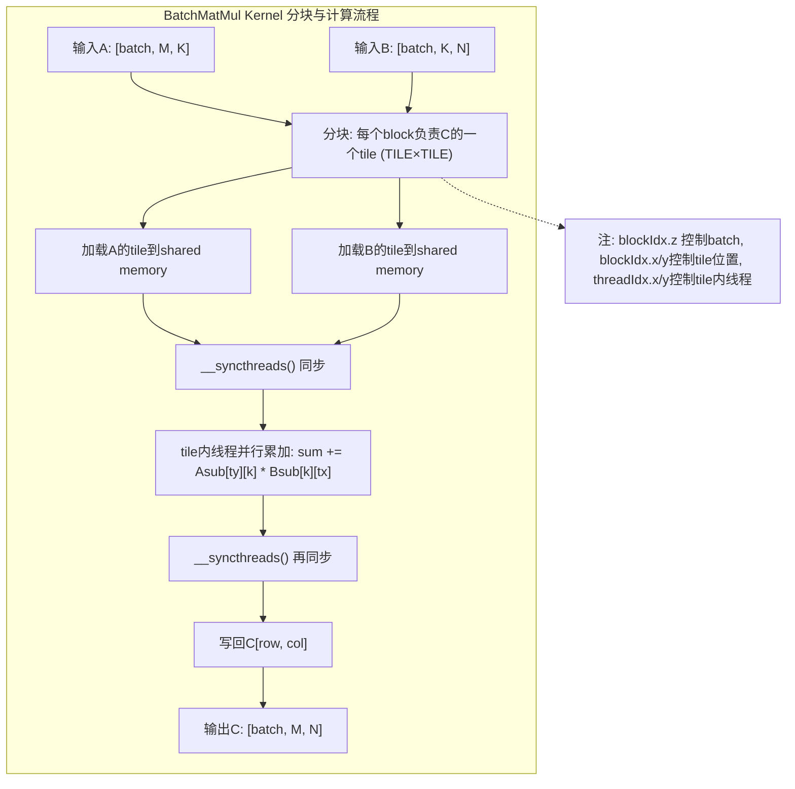

# CUDA BatchMatMul 算子实现详解

## 1. 算子功能与接口
BatchMatMul（批量矩阵乘法）支持对一批矩阵对 (A, B) 进行并行乘法，输出 C = A × B，支持多维 batch，常用于深度学习中的批量线性变换。

- 输入A: shape = [batch..., M, K]
- 输入B: shape = [batch..., K, N]
- 输出C: shape = [batch..., M, N]
- 支持 float/double，batch 维度可为多维

## 2. Kernel 分块与共享内存优化原理

### 2.1 分块（Tiling）思想
- 将大矩阵分为多个小 tile（子块），每个 tile 由一个 thread block 负责计算。
- 每个 tile 大小为 TILE×TILE（如16×16），由 blockDim.x/blockDim.y 控制。
- 这样可以让每个线程块协作加载 tile 到 shared memory，极大减少全局内存访问次数。

### 2.2 线程分工
- 每个 thread block 负责输出 C 的一个 tile（即 C 的一个 TILE×TILE 子矩阵）。
- blockIdx.x/blockIdx.y 决定 tile 在 C 中的位置，blockIdx.z 决定 batch 索引。
- threadIdx.x/threadIdx.y 决定线程在 tile 内的行列。
- 每个线程负责计算 C[row, col] 的一个元素（或多个元素）。

### 2.3 Kernel 主要流程
1. **批次定位**：每个 block 通过 blockIdx.z 处理一个 batch。
2. **tile 循环**：沿 K 维分块，循环加载 A、B 的 tile 到 shared memory：
   - A 的 tile: Asub[threadIdx.y][threadIdx.x] = A[row, t*TILE+tx]
   - B 的 tile: Bsub[threadIdx.y][threadIdx.x] = B[t*TILE+ty, col]
   - 边界处理：超出矩阵实际范围的元素填 0。
3. **同步计算**：
   - __syncthreads() 保证所有线程都加载完 tile。
   - 每个线程累加本 tile 的乘法结果：sum += Asub[ty][k] * Bsub[k][tx]
4. **写回结果**：tile 内所有线程完成后，将 sum 写回 C[row, col]。

### 2.4 伪代码示例
```cpp
for (int t = 0; t < (K + TILE - 1) / TILE; ++t) {
    // 加载A、B的tile到shared memory
    Asub[ty][tx] = (row < M && t*TILE+tx < K) ? A[row*K + t*TILE+tx] : 0;
    Bsub[ty][tx] = (t*TILE+ty < K && col < N) ? B[(t*TILE+ty)*N + col] : 0;
    __syncthreads();
    // 累加本tile的乘法
    for (int k = 0; k < TILE; ++k)
        sum += Asub[ty][k] * Bsub[k][tx];
    __syncthreads();
}
if (row < M && col < N)
    C[row*N + col] = sum;
```

### 2.5 边界处理
- 对于不能整除 TILE 的矩阵，tile 边界外的元素用 0 填充，防止越界访问。
- 写回 C 时也需判断 row < M, col < N。

### 2.6 优势
- 显著减少全局内存访问，提升带宽利用率。
- 线程协作高效，适合中大规模矩阵批量乘法。
- 结构简单，易于扩展和调优。

## 3. 性能建议
- TILE 可根据显卡 shared memory 大小调整（常用16或32）。
- 对于极大矩阵/高性能需求，建议优先用 cuBLAS（如 cublasGemmStridedBatched）。
- 该 kernel 适合自定义场景、教学和中等规模矩阵。

## 4. 参考
- [NVIDIA CUDA Programming Guide: Matrix Multiplication and Shared Memory](https://docs.nvidia.com/cuda/cuda-c-programming-guide/index.html#shared-memory-example-matrix-multiplication)
- [cuBLAS Documentation](https://docs.nvidia.com/cuda/cublas/index.html)

---

## 5. 计算流程Mermaid图


