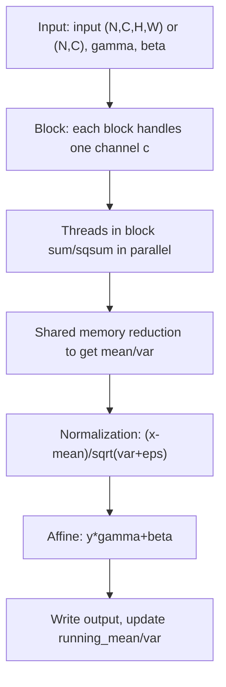

# CUDA BatchNorm 算子实现详解

## 1. 算子功能
BatchNorm（批归一化）用于对每个通道做归一化处理，提升神经网络训练稳定性，加速收敛。

- 支持输入 shape: [N, C, H, W]（NCHW格式）或 [N, C]（2D）
- 支持 float/double
- 支持自定义 eps

## 2. 算法原理与公式
对每个通道 c：
- 均值:  mean[c] = 1/(N*H*W) * sum_{n,hw} x[n,c,hw]   （2D时H×W=1）
- 方差:  var[c]  = 1/(N*H*W) * sum_{n,hw} (x[n,c,hw] - mean[c])^2
- 归一化: y[n,c,hw] = (x[n,c,hw] - mean[c]) / sqrt(var[c] + eps)
- 仿射变换: out[n,c,hw] = y[n,c,hw] * gamma[c] + beta[c]

## 3. kernel 计算流程与分块优化
1. **分块策略**：每个block负责一个通道c，block内多个线程并行处理该通道的所有像素（N×H×W，2D时N）。
2. **线程分工**：每个线程处理部分像素，先在寄存器累加自己的和/平方和。
3. **__shared__归约**：用shared memory做block内归约，得到全通道的均值/方差。
4. **归一化写回**：所有线程并行归一化并写回输出。
5. **优势**：极大提升了大空间/大batch下的归约效率。

### 3.1 伪代码示例
```cpp
// blockIdx.x = c, threadIdx.x = tid
extern __shared__ float sdata[];
float sum = 0, sqsum = 0;
for (int i = tid; i < N*HxW; i += blockDim.x) {
    float v = ...; // 4D: input[(n*C+c)*HxW+hw]，2D: input[n*C+c]
    sum += v;
    sqsum += v * v;
}
sdata[tid] = sum;
sdata[blockDim.x + tid] = sqsum;
__syncthreads();
// 归约到sdata[0], sdata[blockDim.x]
for (int s = blockDim.x/2; s > 0; s >>= 1) {
    if (tid < s) {
        sdata[tid] += sdata[tid + s];
        sdata[blockDim.x + tid] += sdata[blockDim.x + tid + s];
    }
    __syncthreads();
}
float mean = sdata[0] / (N*HxW);
float var = sdata[blockDim.x] / (N*HxW) - mean * mean;
// ...归一化写回...
```

## 4. 参数说明
- input: 输入张量 [N, C, H, W] 或 [N, C]
- output: 输出张量 [N, C, H, W] 或 [N, C]
- gamma: 缩放参数 [C]
- beta: 偏置参数 [C]
- running_mean: 保存每个通道均值 [C]
- running_var: 保存每个通道方差 [C]
- eps: 数值稳定性参数，默认1e-5

## 5. 用法示例
```cpp
// 4D用法
Tensor<float> input4d({8, 32, 16, 16});
Tensor<float> output4d;
Tensor<float> gamma({32}), beta({32});
Tensor<float> running_mean, running_var;
gamma.ones();
beta.zero();
BatchNorm<float> bn;
bn.Forward(input4d, output4d, gamma, beta, running_mean, running_var, 1e-5f);

// 2D用法
Tensor<float> input2d({8, 32});
Tensor<float> output2d;
bn.Forward(input2d, output2d, gamma, beta, running_mean, running_var, 1e-5f);
```

## 6. 性能与注意事项
- 适合中小通道数（C），大C时可进一步优化为分块归约。
- 支持NCHW格式和2D输入。
- eps建议不小于1e-5。
- 使用__shared__归约大幅提升了均值/方差计算效率。

## 7. 参考
- [Batch Normalization: Accelerating Deep Network Training by Reducing Internal Covariate Shift](https://arxiv.org/abs/1502.03167)
- [PyTorch BatchNorm2d](https://pytorch.org/docs/stable/generated/torch.nn.BatchNorm2d.html)

---

## 8. BatchNorm kernel 流程Mermaid图


