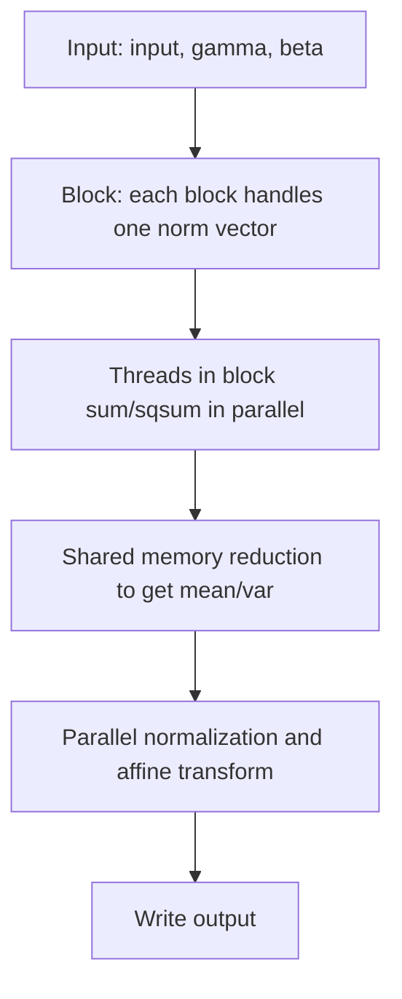

# CUDA LayerNorm 算子实现详解

## 1. 算子功能
LayerNorm（层归一化）对每个样本的特征维做归一化，常用于NLP、Transformer等模型，提升训练稳定性。

- 支持任意shape输入，支持float/double
- 支持自定义eps，支持指定归一化维度（normalized_dim）

## 2. 算法原理与公式
对每个归一化向量（如一行）：
- 均值:  mean = 1/N * sum_i x[i]
- 方差:  var  = 1/N * sum_i (x[i] - mean)^2
- 归一化: y[i] = (x[i] - mean) / sqrt(var + eps)
- 仿射变换: out[i] = y[i] * gamma[i] + beta[i]

## 3. kernel 并行归约计算流程
1. **分块策略**：每个block负责一个归一化向量（如一行），block内多个线程并行处理该向量的所有元素。
2. **线程分工**：每个线程处理部分元素，先本地累加sum/sqsum。
3. **__shared__归约**：用shared memory做block内归约，得到均值/方差。
4. **归一化写回**：所有线程并行归一化并写回输出。
5. **优势**：极大提升大特征/大通道场景下的效率。

### 3.1 伪代码示例
```cpp
// blockIdx.x = 行号，threadIdx.x = tid
extern __shared__ float sdata[];
float sum = 0, sqsum = 0;
for (int i = tid; i < norm_size; i += blockDim.x) {
    float v = input[row * norm_size + i];
    sum += v;
    sqsum += v * v;
}
sdata[tid] = sum;
sdata[blockDim.x + tid] = sqsum;
__syncthreads();
// 归约到sdata[0], sdata[blockDim.x]
for (int s = blockDim.x/2; s > 0; s >>= 1) {
    if (tid < s) {
        sdata[tid] += sdata[tid + s];
        sdata[blockDim.x + tid] += sdata[blockDim.x + tid + s];
    }
    __syncthreads();
}
float mean = sdata[0] / norm_size;
float var = sdata[blockDim.x] / norm_size - mean * mean;
// 并行归一化写回
for (int i = tid; i < norm_size; i += blockDim.x) {
    float v = input[row * norm_size + i];
    float norm = (v - mean) / sqrt(var + eps);
    output[row * norm_size + i] = norm * gamma[i] + beta[i];
}
```

## 4. 参数说明
- input: 输入张量，shape任意
- output: 输出张量，shape同input
- gamma: 缩放参数，shape=归一化维度
- beta: 偏置参数，shape=归一化维度
- normalized_dim: 从第几个维度开始做归一化，支持负数
- eps: 数值稳定性参数，默认1e-5

## 5. 用法示例
```cpp
Tensor<float> input({8, 128});
Tensor<float> output;
Tensor<float> gamma({128}), beta({128});
gamma.ones();
beta.zero();
LayerNorm<float> ln;
ln.Forward(input, output, gamma, beta, 1, 1e-5f); // 对最后一维做归一化
```

## 6. 性能与注意事项
- 适合大特征/大通道/大batch场景。
- eps建议不小于1e-5。
- 并行归约大幅提升了大向量归一化效率。

## 7. 参考
- [Layer Normalization (Ba et al., 2016)](https://arxiv.org/abs/1607.06450)
- [PyTorch LayerNorm](https://pytorch.org/docs/stable/generated/torch.nn.LayerNorm.html)

---

## 8. LayerNorm kernel 计算流程Mermaid图


